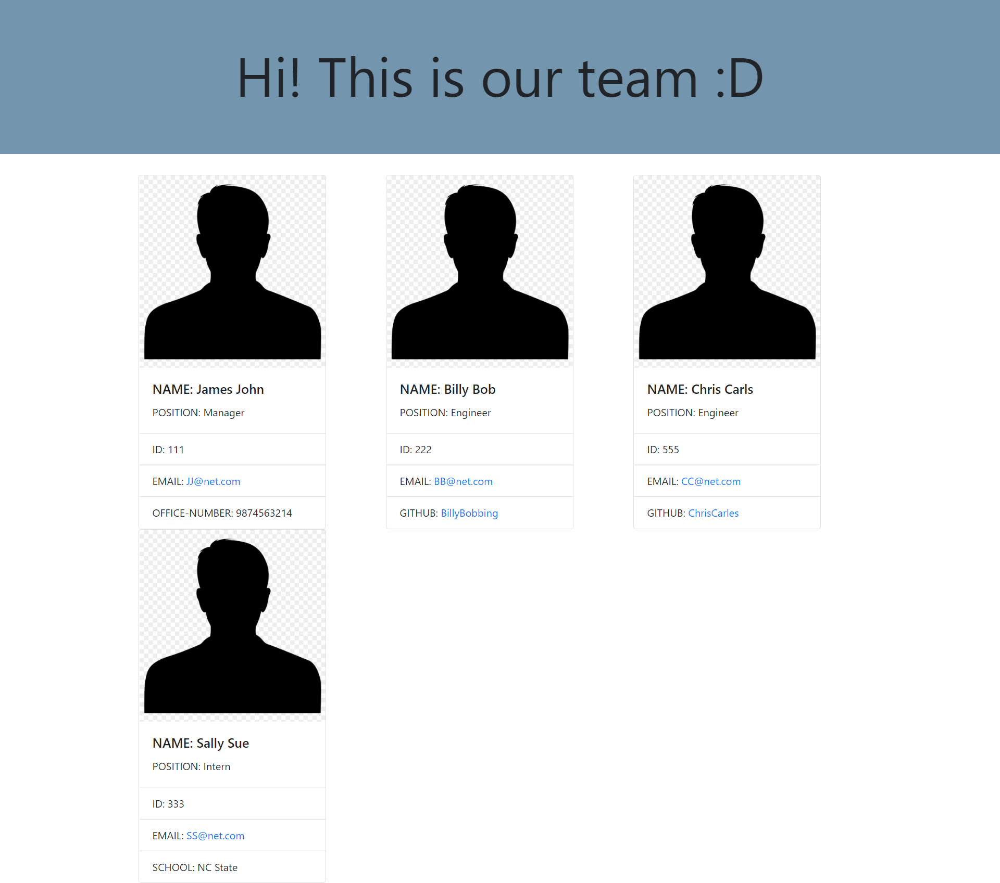
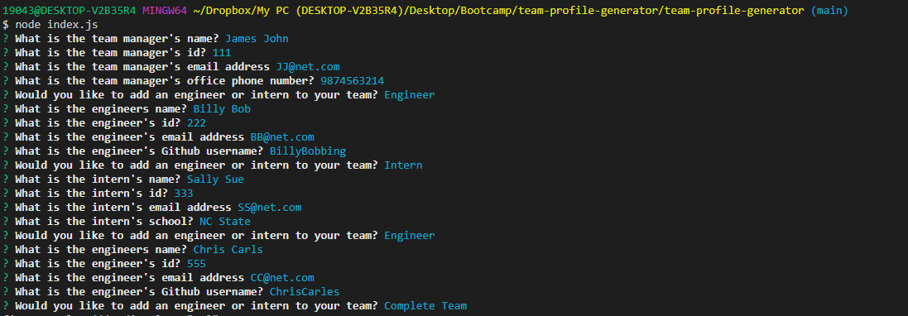
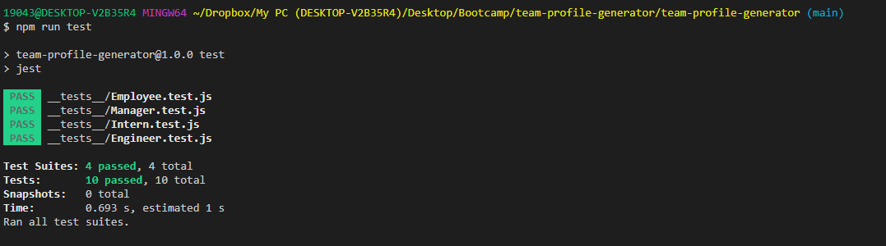

# Team Profile Generator

## Owned By

Annelise Rowan

## Description

Built a Node.js command-line application that takes in information about employees on a software engineering team, then generates an HTML webpage that displays summaries for each person. Testing is key to making code maintainable, so there are unit tests for every part of your code using Jest from NPM. 

• Used Node Js, Javascript, NPM – Inquirer, Command Line, FS, Jest, Path

## Example

Here is a walk-through video for you: https://youtu.be/B2oAVtXVL2E

Please do not hesitate to open a PR if there are any bugs or issues you come across! :D
